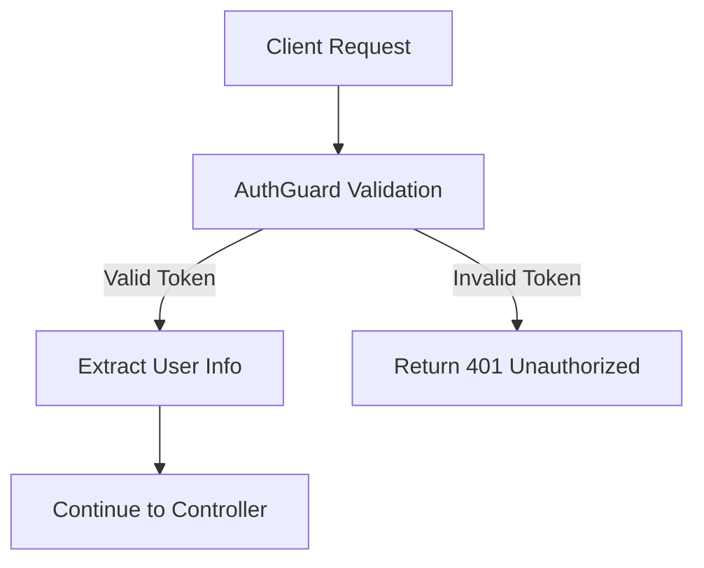
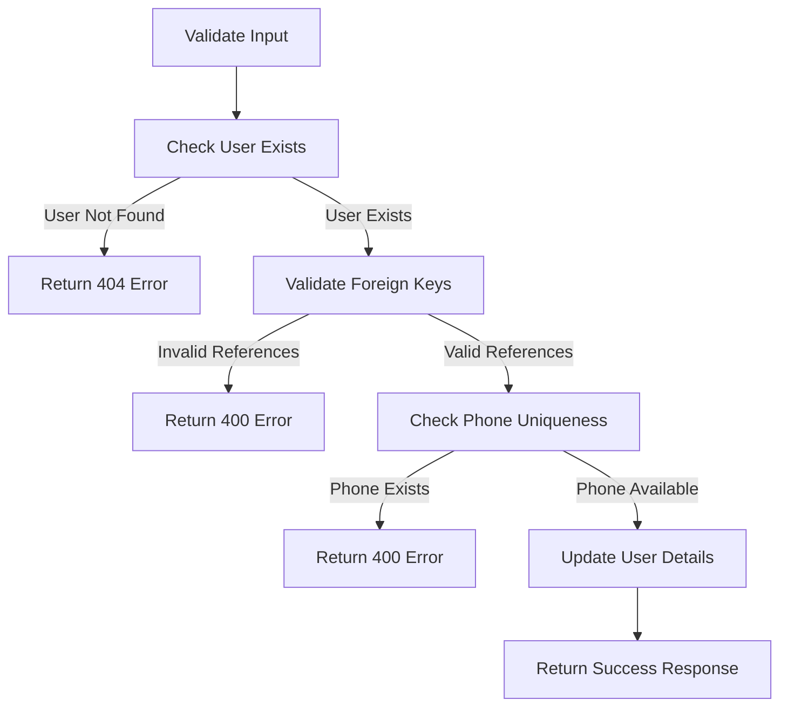
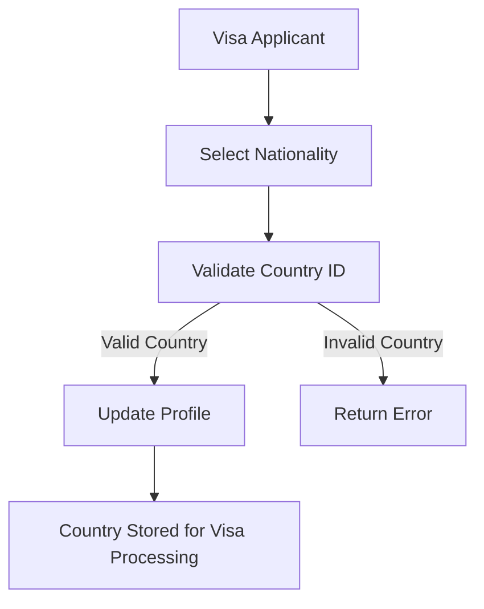
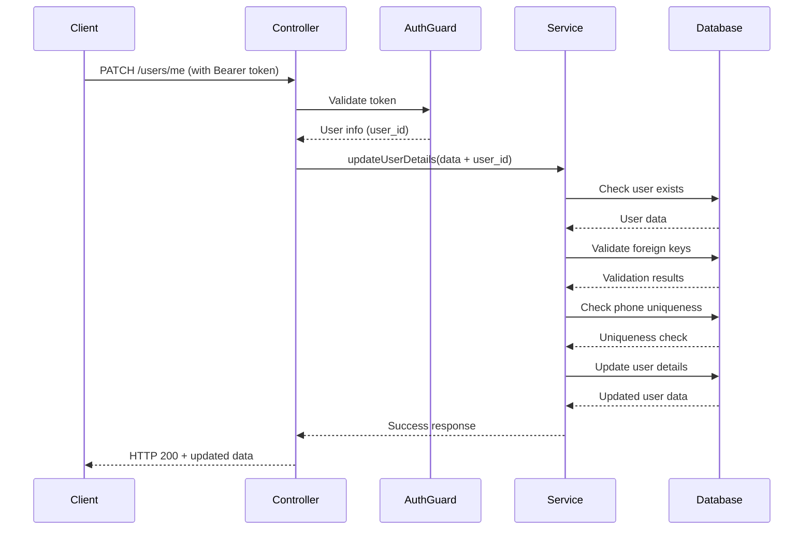

# Visa Applicant Profile Update Process Flow

## Overview
This document describes the process flow for updating visa applicant profile details in the NIS (Nigeria Immigration Service) Backend system. This functionality is specifically designed for users with passports who are applying for Nigerian visas.

## Target Users
- **Visa Applicants**: Individuals with valid passports applying for Nigerian visas
- **Self-Service**: Applicants updating their own profile information
- **Profile Management**: Maintaining accurate applicant data for visa processing

## Endpoint
- **Method**: `PATCH`
- **Path**: `/api/v1/users/me`
- **Authentication**: Required (Bearer Token)
- **Purpose**: Allow visa applicants to update their personal information

## Process Flow

### 1. Request Authentication


- Client sends request with Bearer token
- `AuthGuard` validates the JWT token
- User information extracted from token (`req.user.sub` = user_id)
- If authentication fails, return 401 Unauthorized

### 2. Controller Processing
```typescript
// Controller: apps/auth/src/users/users.controller.ts
@UseGuards(AuthGuard)
@ApiBearerAuth()
@Patch('me')
async updateUserDetails(
    @Body() data: UpdateUserDetailsDto,
    @Request() req
): Promise<CustomHttpResponse>
```

**Steps:**
1. Receive update data from request body
2. Extract authenticated user ID from `req.user.sub`
3. Merge user_id with update data
4. Call service method
5. Map service response to HTTP response

### 3. Service Validation & Processing

#### 3.1 Input Validation
```typescript
// Service: libs/users/src/users.service.ts
async updateUserDetails(data: UpdateUserDetailsDto): Promise<ServiceResponse>
```

**Validation Steps:**
1. **User ID Check**: Ensure user_id is provided
2. **User Existence**: Verify user exists in database
3. **Foreign Key Validation**:
   - Validate `role_id` (if provided)
   - Validate `country_id` (if provided) 
   - Validate `state_id` (if provided)
4. **Phone Uniqueness**: Check phone number isn't used by another user

#### 3.2 Database Operations Flow


### 4. Database Update Process

#### 4.1 Update Operation
```typescript
const updatedUserDetails = await this.dbService.userDetail.update({
    where: { user_id },
    data: {
        ...updateData,
        updater_id: user_id, // Self-update tracking
    },
    include: {
        role: true,
        country: true,
        state: true,
        passport_records: true,
    }
});
```

**Features:**
- Updates only provided fields (partial update)
- Sets `updater_id` to current user (audit trail)
- Returns updated record with related data

#### 4.2 Updatable Fields (Visa Applicant Context)
| Field | Type | Description | Visa Application Context |
|-------|------|-------------|-------------------------|
| `first_name` | String | Applicant's first name | Must match passport |
| `middle_name` | String | Applicant's middle name | Must match passport |
| `surname` | String | Applicant's surname | Must match passport |
| `phone` | String | Contact phone number (unique) | For visa processing communication |
| `gender` | Enum | Gender (Male/Female) | Must match passport |
| `address` | String | Applicant's residential address | Current residence for visa application |
| `visa_center` | String | Preferred visa processing center | Where applicant wants to submit documents |
| `state_id` | String | Reference to Nigerian state | For visa center location preferences |
| `country_id` | String | Reference to applicant's country | Nationality/country of passport |
| `role_id` | String | User role (typically 'APPLICANT') | System role for visa applicants |

### 5. Response Flow

#### 5.1 Success Response
```json
{
  "statusCode": 200,
  "message": "SUCCESSFUL",
  "body": {
    "user_id": "user_123",
    "first_name": "Updated Name",
    "phone": "1234567890",
    "role": { "id": "role_1", "name": "Admin" },
    "country": { "id": "ng", "name": "Nigeria" },
    "state": { "id": "lag", "name": "Lagos" },
    "passport_records": [...]
  },
  "customMessage": "User details updated successfully"
}
```

#### 5.2 Error Responses
| Error Code | Scenario | Message |
|------------|----------|---------|
| `400` | Missing user_id | "User ID is required" |
| `400` | Invalid role_id | "Role does not exist" |
| `400` | Invalid country_id | "Country does not exist" |
| `400` | Invalid state_id | "State does not exist" |
| `400` | Phone already exists | "This phone number is already registered to another user" |
| `401` | Invalid/missing token | "Unauthorized" |
| `404` | User not found | "User does not exist" |

### 6. Security Features

#### 6.1 Authentication & Authorization
- JWT token validation via `AuthGuard`
- Visa applicants can only update their own profile
- No admin privileges required for self-update
- Secure passport holder verification

#### 6.2 Data Integrity for Visa Processing
- Foreign key validation prevents orphaned references
- Phone number uniqueness prevents conflicts
- Country validation ensures valid nationality
- State validation for Nigerian visa center locations
- Audit trail via `updater_id` field for compliance

### 7. Country Data Management

#### 7.1 Countries Seeding
The system includes a dedicated command to seed country data:

```bash
pnpm run seed:countries
```

**Purpose**: 
- Populates the database with all world countries
- Essential for visa applicant nationality selection
- Required before applicants can update their country information

**Command Details**:
```bash
ts-node -e "
  import { seedCountries } from './libs/db/src/seeders/utils.seed'; 
  import { PrismaClient } from '@prisma/core/client'; 
  const prisma = new PrismaClient(); 
  seedCountries(prisma)
    .then(() => prisma.$disconnect())
    .catch((e) => { 
      console.error(e); 
      prisma.$disconnect(); 
      process.exit(1); 
    })
"
```

#### 7.2 Country Selection Flow


**Important Notes**:
- Run `pnpm run seed:countries` before allowing profile updates
- Country data is crucial for visa processing workflows
- Applicants must select their passport-issuing country

### 7. Complete Flow Diagram


## Error Handling

### Validation Errors
- All validation errors return appropriate HTTP status codes
- Clear error messages for client debugging
- Consistent error response format

### Database Errors
- Transaction safety (atomic operations)
- Proper error logging for debugging
- Graceful error handling and user-friendly messages

## Usage Examples

### Visa Applicant Profile Update
```bash
curl -X PATCH /api/v1/users/me \
  -H "Authorization: Bearer <token>" \
  -H "Content-Type: application/json" \
  -d '{
    "first_name": "John",
    "middle_name": "Michael",
    "surname": "Doe",
    "phone": "+234123456789",
    "gender": "MALE"
  }'
```

### Update Nationality and Location Preferences
```bash
curl -X PATCH /api/v1/users/me \
  -H "Authorization: Bearer <token>" \
  -H "Content-Type: application/json" \
  -d '{
    "address": "123 Main Street, New York",
    "country_id": "us", 
    "state_id": "lag",
    "visa_center": "Lagos Visa Application Centre"
  }'
```

### Complete Visa Applicant Profile
```bash
curl -X PATCH /api/v1/users/me \
  -H "Authorization: Bearer <token>" \
  -H "Content-Type: application/json" \
  -d '{
    "first_name": "Maria",
    "middle_name": "Elena",
    "surname": "Rodriguez", 
    "phone": "+52123456789",
    "gender": "FEMALE",
    "address": "Av. Reforma 456, Mexico City",
    "country_id": "mx",
    "state_id": "abj",
    "visa_center": "Abuja Visa Application Centre"
  }'
```

---

## Setup Requirements

### 1. Database Seeding
Before visa applicants can update their profiles, ensure countries are seeded:

```bash
# Seed all countries for nationality selection
pnpm run seed:countries

# Verify countries are loaded
pnpm run start:dev
# Check GET /api/v1/countries endpoint
```

### 2. Visa Center Configuration
Ensure Nigerian states are configured for visa center selection:
- Lagos (lag) - Lagos Visa Application Centre
- Abuja (abj) - Abuja Visa Application Centre  
- Other states as needed

---

## Files Modified/Created

1. **`apps/auth/src/users/users.dto.ts`** - Created UpdateUserDetailsDto for visa applicants
2. **`libs/users/src/users.service.ts`** - Added updateUserDetails method with nationality validation
3. **`apps/auth/src/users/users.controller.ts`** - Added PATCH /me endpoint for self-service updates
4. **`libs/db/src/seeders/utils.seed.ts`** - Contains seedCountries function
5. **`package.json`** - Added `seed:countries` command

## Dependencies

- `@nestjs/common` - Controllers, decorators, guards
- `@prisma/core/client` - Database operations with country/state relations
- `class-validator` - Input validation for visa applicant data
- `@nestjs/swagger` - API documentation for visa application system
- `bcryptjs` - Password security
- `@nestjs/jwt` - JWT token authentication for applicants

## Visa Application Context

This profile update system is part of the larger Nigerian visa application process:

1. **Applicant Registration** → Profile creation with passport details
2. **Profile Updates** → This system (updating personal information)  
3. **Visa Application** → Submitting visa applications with updated profile
4. **Document Upload** → Attaching required documents
5. **Processing** → NIS processing with accurate applicant data